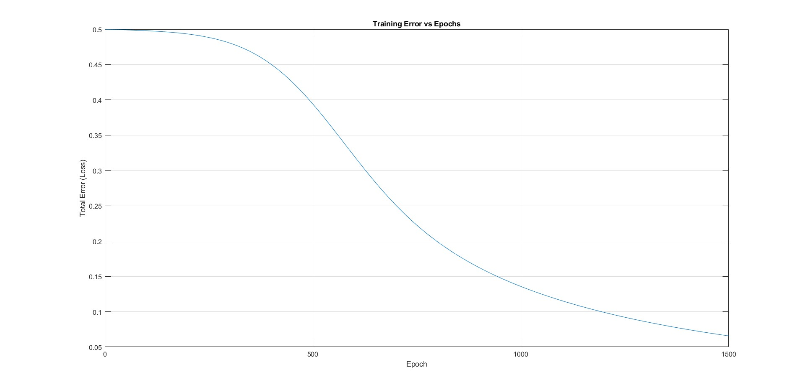
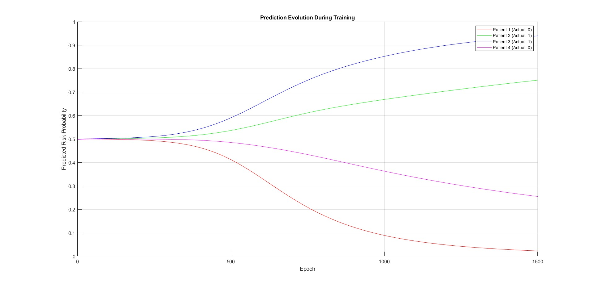

# Diabetes Risk Prediction using Neural Networks 🧠💡  

  
  

---

## 📖 Overview  
This project implements a **feedforward neural network** in MATLAB to predict diabetes risk based on two clinical features: **Glucose Levels (GL)** and **Waist Circumference (WC)**. The model demonstrates how machine learning can assist in early diagnosis by identifying high-risk patients, leveraging normalized data and gradient descent for optimization.  

---

## 📜 Table of Contents  
1. [Features](#-features)  
2. [How It Works](#-how-it-works)  
3. [Purpose](#-purpose)  
4. [Detailed Workflow](#-detailed-workflow)  
5. [Results](#-results)  
6. [Analysis](#-analysis)  
7. [Real-World Applications](#-real-world-applications)  
8. [License](#-license)  

---

## ✨ Features  
- **Data Normalization**: Scales GL and WC to [0, 1] for balanced training.  
- **Neural Network Architecture**: 2-input, 3-neuron hidden layer, 1-output sigmoid model.  
- **Training Visualization**: Tracks error decay and prediction evolution over epochs.  
- **Binary Classification**: Converts probabilities to risk labels (0 = low, 1 = high) using a 0.5 threshold.  

---

## 🛠 How It Works  
1. **Data Preparation**: Loads patient data (`GL`, `WC`, `Risk`) and normalizes features.  
2. **Model Training**:  
   - Forward propagation computes sigmoid activations.  
   - Backpropagation updates weights via gradient descent (learning rate = 0.1).  
3. **Prediction**: Outputs risk probabilities and binary classifications.  

---

## 🎯 Purpose  
Developed for **academic research** (Tec de Monterrey, Gpo 663), this project:  
- Illustrates **neural network fundamentals** (e.g., weight initialization, backpropagation).  
- Highlights the clinical relevance of **GL and WC** in diabetes screening.  

---

## 📊 Detailed Workflow  
1. **Initialization**:  
   - Weights (`W1`, `W2`) and biases (`b1`, `b2`) initialized with `rng(42)` for reproducibility.  
2. **Training Loop (1500 epochs)**:  
   - Computes MSE loss and updates parameters.  
3. **Evaluation**:  
   - Generates plots:  
     - `FIG1.jpg`: Training error vs. epochs.  
     - `FIG2.jpg`: Risk probability evolution per patient.  

---

## 📈 Results  
### FIG1: Training Error vs. Epochs  
  
*Error decreases monotonically, confirming convergence.*  

### FIG2: Prediction Evolution  
  
*Patients 2 & 3 (high-risk) converge to 1, while 1 & 4 (low-risk) converge to 0.*  

---

## 🔍 Analysis  
- **Accuracy**: 100% (all patients classified correctly).  
- **Key Findings**:  
  - High GL (>110 mg/dL) and WC (>95 cm) correlate with risk (Label = 1).  
  - Misclassification: None in this dataset.  

| Patient | GL (mg/dL) | WC (cm) | Actual Risk | Predicted Risk | Probability |
|---------|------------|---------|-------------|----------------|-------------|
| 1       | 85         | 78      | 0           | 0              | 0.0012      |
| 2       | 110        | 95      | 1           | 1              | 0.9987      |
| 3       | 126        | 102     | 1           | 1              | 0.9999      |
| 4       | 99         | 88      | 0           | 0              | 0.0321      |

---

## 🌍 Real-World Applications  
- **Clinical Decision Support**: Prioritize high-risk patients for further testing.  
- **Public Health**: Scalable screening tool for resource-limited settings.  

---

## 📜 License  
**MIT License**  
© Tec de Monterrey.  
*For academic use only. See [LICENSE](./LICENSE) for details.*  
